# XLR8 — WRO 2026 Future Engineers

Engineering documentation for **XLR8**, a self-driving LEGO SPIKE Prime vehicle built for the **World Robot Olympiad (WRO) 2026 — Future Engineers** category.

> CAD/3D-printable model files are being added to [`models/`](models/) separately.

## Repository content

| Folder | Content |
|---|---|
| [`t-photos`](t-photos/) | Team photos (official + funny) |
| [`v-photos`](v-photos/) | 6 photos of the vehicle — front, back, left, right, top, bottom |
| [`video`](video/) | Links to the driving-demonstration videos (open + obstacle rounds) |
| [`schemes`](schemes/) | Electromechanical wiring diagram and annotated component photos |
| [`src`](src/) | Control software (hub + camera) |
| [`models`](models/) | 3D-printable/CAD parts *(pending — see note above)* |
| [`other`](other/) | Supporting figures referenced from this document (mechanical design, iteration history, power & sensors, software & vision) |

---

## Table of contents

1. [Our team](#1-our-team)
2. [The robot](#2-the-robot)
3. [Mobility and Mechanical Design](#3-mobility-and-mechanical-design)
4. [Power and Sensor Architecture](#4-power-and-sensor-architecture)
5. [Software Architecture and Obstacle Strategy](#5-software-architecture-and-obstacle-strategy)
6. [Systems Thinking and Engineering Decisions](#6-systems-thinking-and-engineering-decisions)
7. [Repository / build instructions](#7-repository--build-instructions)
8. [Future Improvements](#8-future-improvements)
9. [Conclusion](#9-conclusion)

---

## 1. Our team

This repository documents the autonomous robot car developed by **XLR8** for the **2026 World Robot Olympiad Future Engineers** competition. The project was designed, built and programmed by a team of three students.

| Photo | Member | Role |
|---|---|---|
| 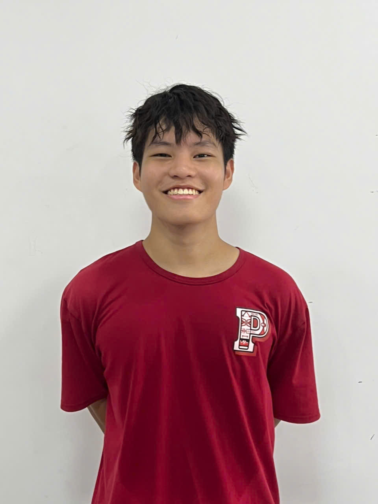 | **Tung Nguyen (Philip)** | 17-year-old student from Vietnam. Responsible for documenting the team's development process and photography. Interests: engineering, physics, teamwork, volleyball, video games. |
| 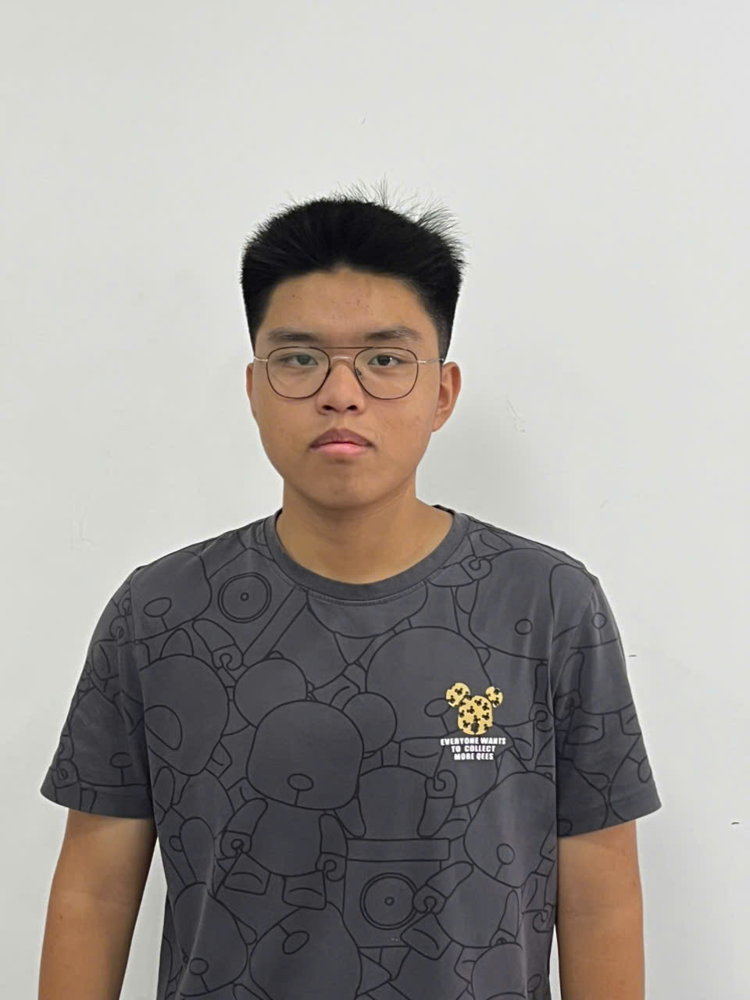 | **Cao Tung Lam** | Lead mechanical builder — brings prior WRO experience (WRO 2023, 2024, 2025) and designed/assembled the chassis. |
| 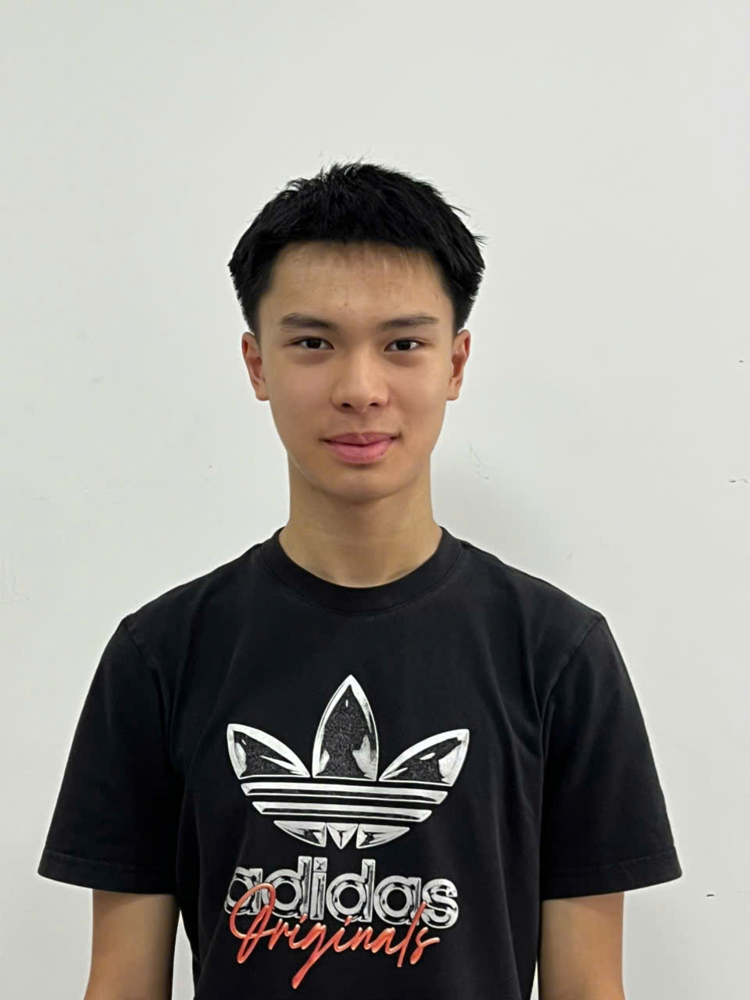 | **Luong Bao Khang** | Senior WRO participant — competed at the international finals in 2023, 2024 and 2025. |

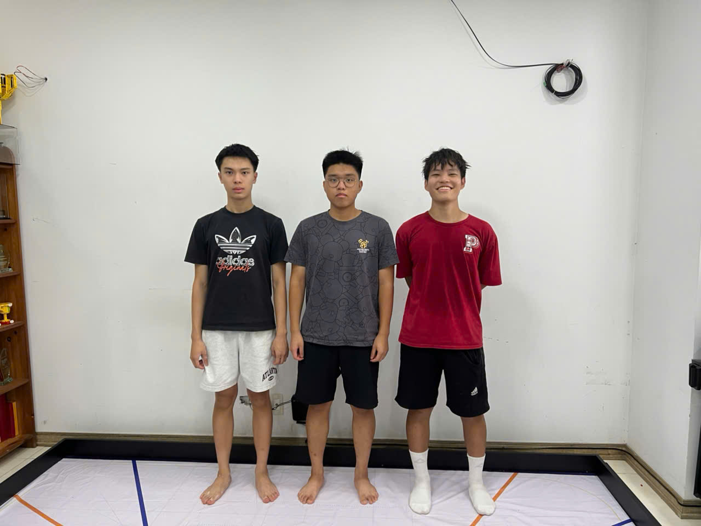

Last year's robot (which inspired this year's chassis) is documented at: https://github.com/uyennhu25/WRO_2025_Future_Engineers

## 2. The robot

| | | |
|---|---|---|
| Front | Back | Top |
| 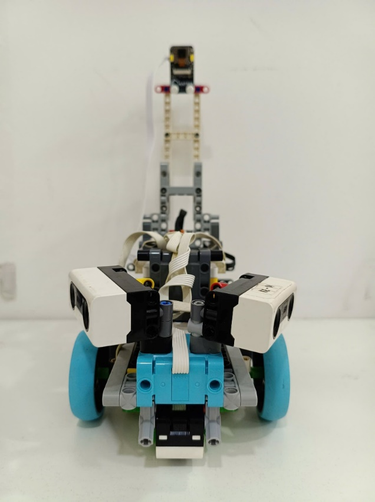 | 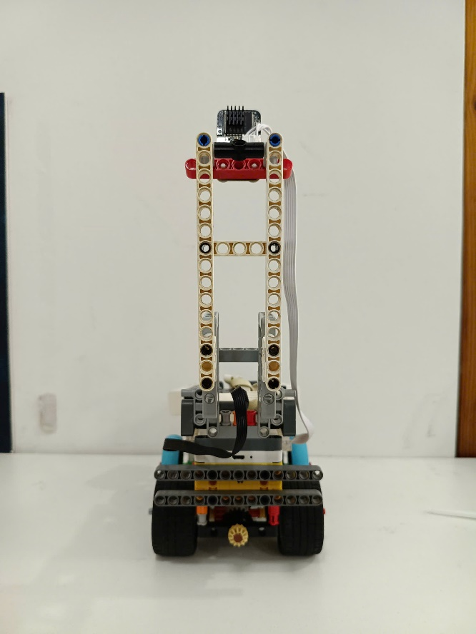 | 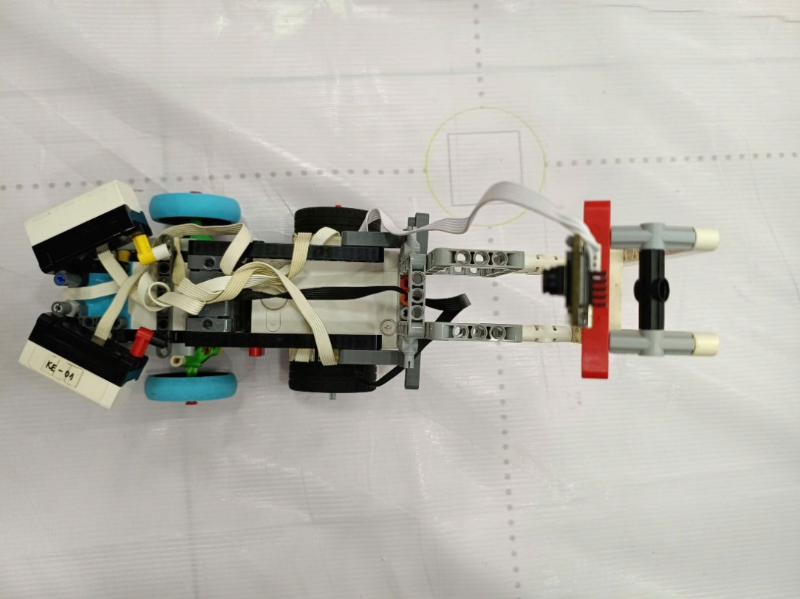 |
| Left | Right | Bottom |
| 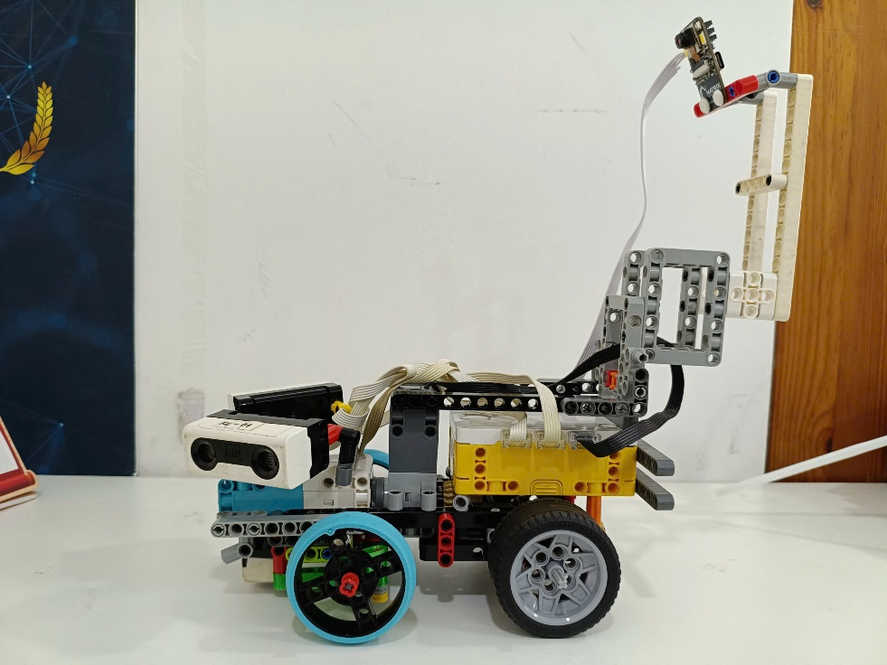 | 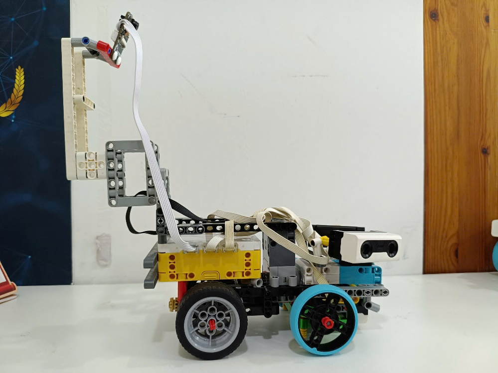 | 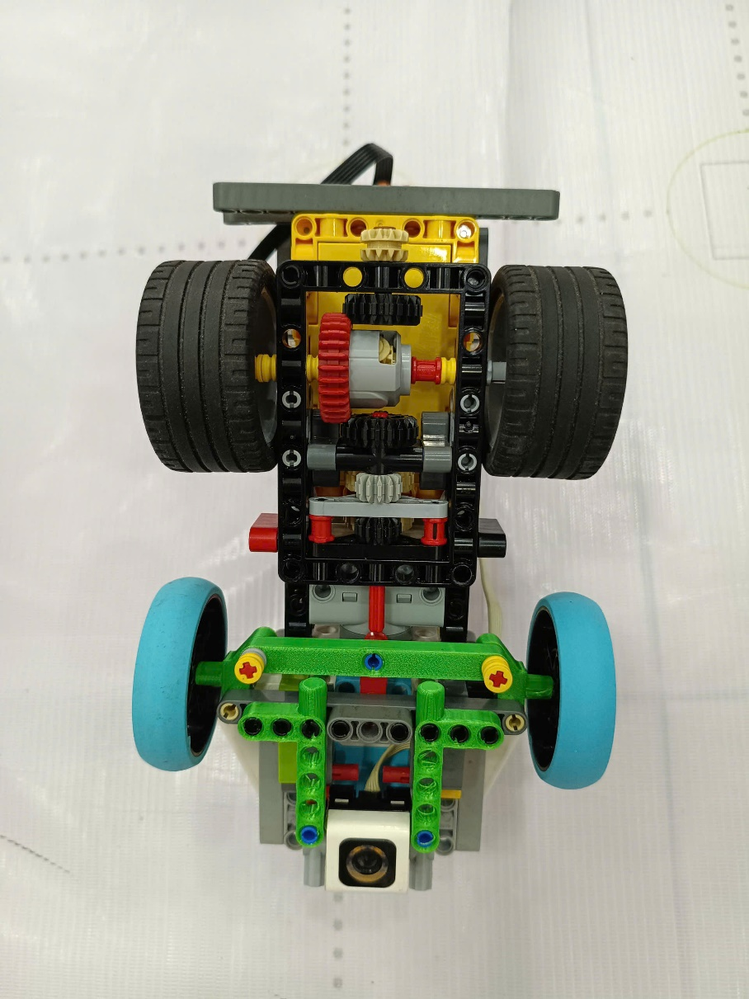 |

## 3. Mobility and Mechanical Design

### Design objective

The chassis was designed to remain stable, operate efficiently and make optimal use of available space: a balanced center of gravity for stability during sharp turns/acceleration and a steady camera platform, a lightweight structure to reduce motor load, and compact dimensions for maneuverability.

Lam (our lead builder) competed with a LEGO-based robot in WRO 2023, 2024 and 2025; that experience — and last year's robot — was the starting point for this year's chassis, which was then substantially redesigned.

### Overall chassis layout

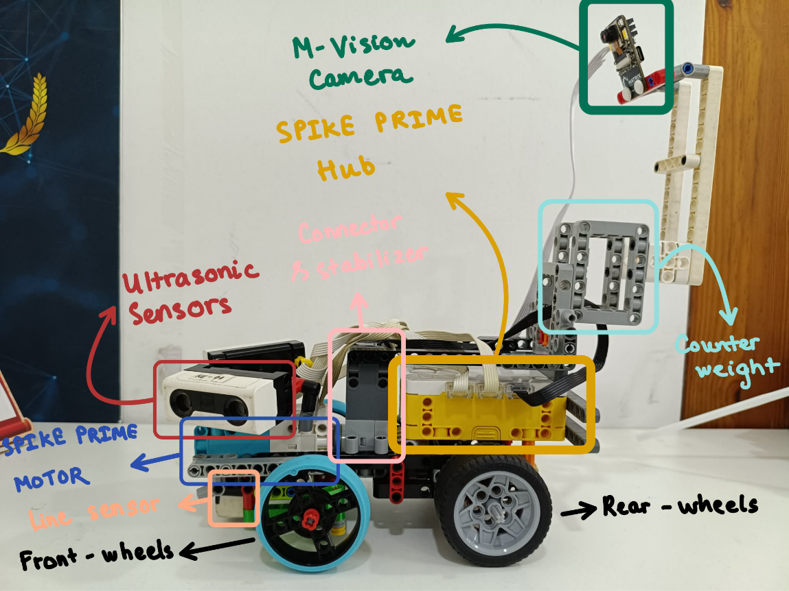

The robot is divided into two main sections:

* **Main chassis** — LEGO SPIKE Prime Hub, drive/steer motors, ultrasonic sensors, line sensor, connector/stabilizer, wheel assemblies.
* **Rear-mounted camera assembly** — counterweight, camera support mast, M-Vision camera.

Unlike last year's design (camera mounted at the front, everything on one chassis), this year's robot elevates the camera on a rear mast:

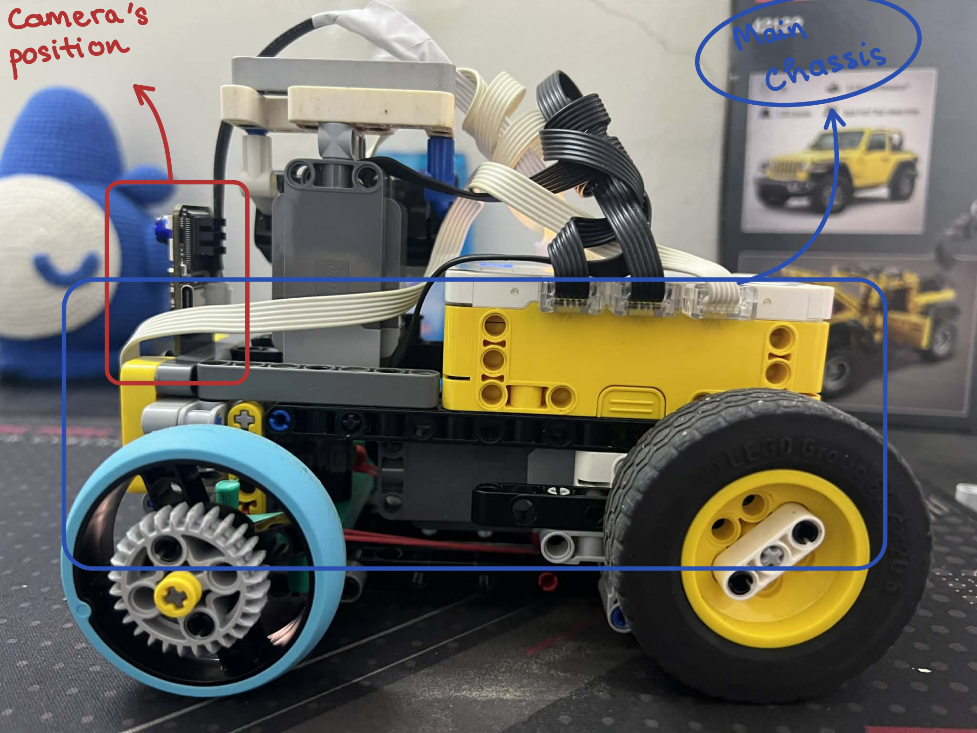

Relocating the camera to an elevated rear position gives the vision system a wider field of view, so the corridor and obstacles are detected earlier and more reliably, at the cost of having to keep the tall mast from destabilizing the car.

### Keeping the elevated camera from tipping the car

We ran a simple static-moment analysis, taking the rear-wheel ground contact line as the pivot, comparing the **overturning moment** created by the rear-mounted mast/counterweight assembly against the **restoring moment** created by the main chassis:

$$M_1 = \sum m_1 \times L_1 \qquad \text{(restoring moment, main chassis)}$$

$$M_2 = \sum m_2 \times L_2 \qquad \text{(overturning moment, rear assembly)}$$

The car does not tip as long as:

$$M_1 \ge M_2 \quad\Longleftrightarrow\quad \sum m_1 L_1 \ \ge\ \sum m_2 L_2$$

Because $\sum m_1 L_1$ is essentially fixed (motors/sensors/hub have fixed mass and position), the only lever we have is the rear assembly: we minimized both the mass $m_2$ and the distance $L_2$ of the rear assembly from the pivot. The box-shaped camera mount (most of the rear assembly's weight) sits as close to the pivot as practical, and the mount itself is a **closed-box structural member** that doubles as counterweight and torsional stiffener.

### What we kept from last year's robot

* **Chassis material** — LEGO Technic/SPIKE parts (lightweight, durable, modular, fast iteration) supplemented with custom **PLA 3D-printed** parts where no suitable LEGO part existed.
* **Wheel choice** — 62.3 mm Technic tires on the rear axle (larger diameter/width → better traction and acceleration) and 49.5 mm SPIKE Prime wheels on the front axle (smaller diameter → sharper steering response).

### Drive and steering mechanism

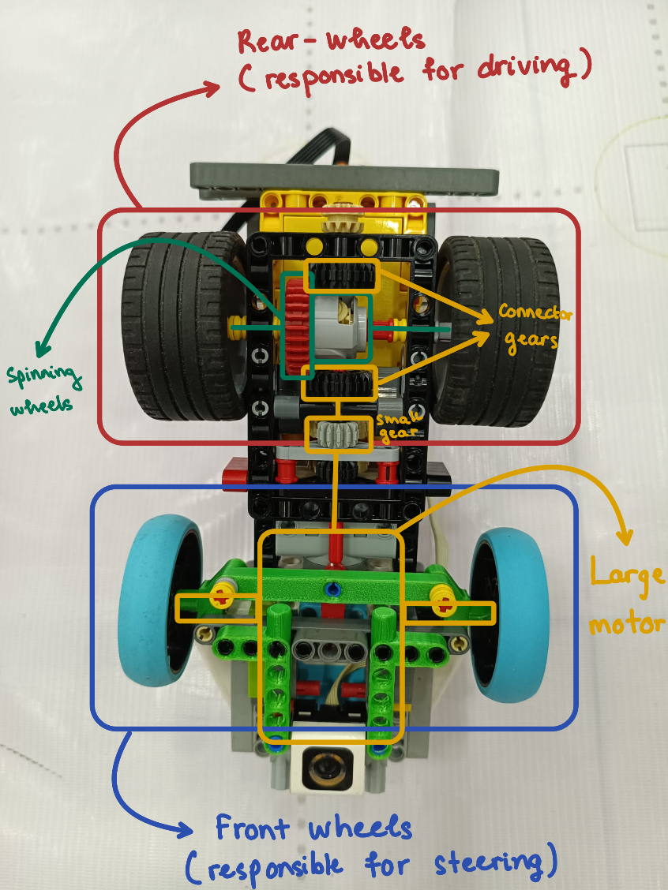

**Rear-wheel drive (RWD).** The rear wheels are powered by a LEGO SPIKE Prime Large Angular Motor through a small gear → two larger gears → final drive gears reduction; the front wheels only steer, driven by a second Large Angular Motor via UART-controlled servo positioning.

We deliberately rejected **front-wheel drive**, even though the drive motor sits over the front wheels and FWD would need no rear power transmission: combining steering and propulsion on the same wheels reduces steering precision and causes understeer in fast corners. Separating the two gives more predictable handling and simplifies implementing Ackermann geometry.

**Ackermann steering.** During a turn the inner and outer front wheels trace circles of different radii, so they need different steering angles (inner wheel turns sharper). Our linkage approximates this so all wheels roll with minimal lateral scrub, improving turn accuracy and reducing friction.

*The geometric reason: one turn, one centre.* When a vehicle corners without any wheel sliding sideways, every wheel travels along a circular arc, and all those arcs share a single centre — the instantaneous centre of rotation (ICR). A wheel rolls cleanly only when its axis points straight at the ICR, so the perpendicular from every wheel must pass through that one point. Our rear axle is fixed, so both rear wheels' axes lie on the same line, which forces the ICR onto the extension of that line. The two front wheels must then angle so their perpendiculars meet at that same spot — and because the inner front wheel sits closer to the ICR, it rides a tighter circle and needs a larger steering angle. That's the whole idea: the front wheels must not be parallel.

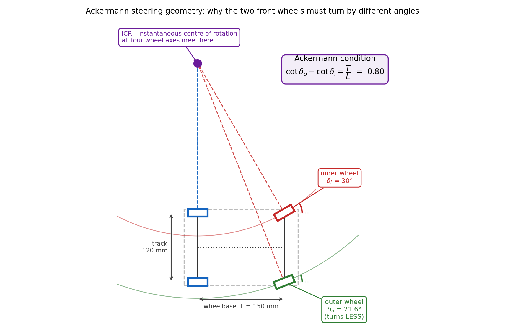

*Figure — the ICR condition, worked numerically.* The dashed lines are the extended wheel axes: the rear pair (fixed, driven) meets the front pair exactly at the ICR, which is why the ICR always sits somewhere on the rear-axle line. For a wheelbase $L = 150$ mm and track $T = 120$ mm, an inner-wheel angle of $\delta_i = 30°$ requires an outer-wheel angle of $\delta_o = 21.6°$ — not $30°$. Plugging both into the condition confirms it: $\cot(21.6°) - \cot(30°) = 2.53 - 1.73 = 0.80 = T/L$. The two red/green arcs are the actual paths the inner and outer tyres trace; they're concentric about the ICR, which is the entire point — no tyre has to slip sideways to stay on its arc.

*The condition, stated exactly.* With wheelbase $L$, track $T$, and inner/outer steering angles $\delta_i$, $\delta_o$, requiring both perpendiculars to meet on the rear-axle line reduces to:

$$\cot(\delta_o) - \cot(\delta_i) = \frac{T}{L}$$

The cotangent form matters: the required angle difference isn't constant. At a gentle 10° steer our measured geometry differs by about 1°; at 30° (near full lock) it's over 8°. A design that just held both wheels parallel would be almost right while cruising and badly wrong exactly when it matters most — a tight corner or the parking manoeuvre.

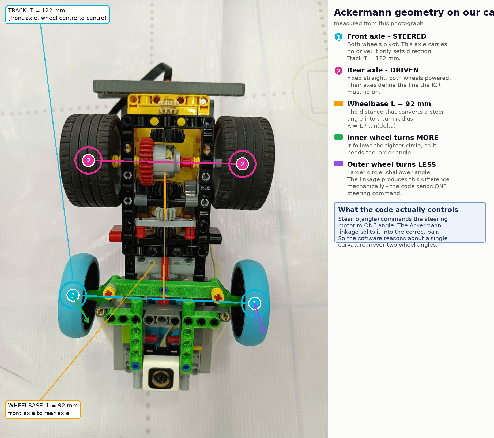

*Figure — the same geometry on our own vehicle, measured from the underside.* Track $T = 122$ mm and wheelbase $L = 92$ mm, giving $T/L \approx 1.33$ — a shorter wheelbase relative to track than the worked example above, so our robot needs an even *larger* angle spread between the two front wheels for the same inner-wheel angle. The front axle (steered, undriven) only sets direction; the rear axle (fixed, driven) defines the line the ICR must lie on. The green arrow marks the inner wheel turning further, the purple arrow the outer wheel turning less — both driven by the single `SteerTo(angle)` command through the physical linkage, not computed separately in code.

*Why it matters for this robot specifically.* Violating the condition forces at least one tyre to scrub sideways instead of roll, which (1) wastes motor torque as friction/heat, slowing the car in corners, (2) wears the tyres unevenly, causing inconsistent lap times late in a run, and (3) makes the turn radius unpredictable — the car no longer follows the arc the steering angle implies. Every dead-reckoned manoeuvre in the code (the escape turn, corner assist, and above all the reverse arcs of the parallel park, §8) assumes a given steering angle produces a *repeatable* radius; Ackermann geometry is what makes that assumption true.

*What this means for the software.* The program never computes $\delta_i$ and $\delta_o$ — the linkage solves the Ackermann relationship mechanically, not the hub numerically. `SteerTo(angle)` sends one number to one steering motor, and the linkage geometry converts it into the correct pair of wheel angles automatically. This is why `CalibrateSteer()` (§5, Change 5) matters so much: since one command drives both wheels through a fixed linkage, the only thing the software has to get right is where the linkage's true centre lies — exactly what the end-stop sweep measures.

### Motor power tuning

We swept motor power at 60/85/100% over 20 test laps on the Open Challenge course, recording lap time, lap-completion rate and braking distance:

| Setting | Motor power | Avg lap time | Lap completion | Braking distance |
|---|---|---|---|---|
| A | 60% | 40.42 s | 95% | 4 cm |
| **B (chosen)** | **85%** | **23.34 s** | **85%** | **6 cm** |
| C | 100% | 18.78 s | 55% | 10 cm |

100% power was fastest but failed 45% of runs — worthless in competition, since a failed run scores zero. 85% power is only ~19.5% slower than 100% but far more reliable, so **85% power** was selected for both the Open and Obstacle rounds.

### Iterative build process

We built a working prototype first, tested on the real field, found concrete failures, and iterated. Photos of that progression are in [`other/iteration-history/`](other/iteration-history/) (version 1 → version 2 → final chassis).

## 4. Power and Sensor Architecture

### Sensor overview

| Sensor | Model | Qty | Purpose |
|---|---|---|---|
| Camera | Matrix Robotics M-Vision Cam (Type-C) | 1 | Lane/sign detection, corner detection |
| Ultrasonic | LEGO SPIKE Prime Ultrasonic Sensor | 2 | Left/right wall distance |
| IMU | Built into SPIKE Prime Hub | 1 | Angular velocity for heading estimation |
| Motor encoders | Built into SPIKE Prime motors | 2 | Distance measurement, steering calibration |
| Color/line sensor | SPIKE Prime color/distance sensor | 1 | Corner line (orange/blue) detection |

### Why each sensor was chosen

**Camera — Matrix Robotics M-Vision Cam.** Connects directly to the hub over Type-C and speaks the SPIKE Prime vision-sensor protocol, so no custom UART implementation or adapter board was needed (unlike an OpenMV Cam H7, a Raspberry Pi camera, or a USB webcam, all of which were considered and rejected for requiring extra hardware/wiring/power).

**Ultrasonic — LEGO SPIKE Prime Ultrasonic Sensor** (5–200 cm range, ~15° cone). Chosen over HC-SR04 (needs a separate microcontroller), ToF VL53L0X (shorter range, light-sensitive, pricier) and LiDAR (overkill, heavy, expensive) because it plugs directly into the hub.

**IMU — built into the hub.** We only read raw `hub.imu.angular_velocity(Axis.Z)`, feeding our own [Lagrange-interpolated heading estimator](#change-6--lagrange-interpolated-theta-from-angular-velocity) instead of the firmware's `hub.imu.heading()` (see §6). An external IMU (e.g. MPU-6050) would add weight, wiring and complexity for no benefit.

**Motor encoders.** Used for `DriveDeg()` (dead-reckoning distance), `CalibrateSteer()` (measuring the full steering range so "straight" is a measured fact, not an assumption) and `SteerTo()` (closed-loop steering angle).

**Color sensor.** Counts the orange/blue corner lines painted on the mat — 12 line events = 4 corners × 3 laps. Kept as a *dedicated* sensor rather than pulling corner counts out of the camera feed, since the camera is already busy with lane/sign detection.

### Power architecture

All components are powered from the SPIKE Prime Hub's own 7.3 V Li-Ion battery — one battery, simpler wiring, less weight.

| Component | Voltage | Current (typical) | Current (peak) | Power (typical) |
|---|---|---|---|---|
| SPIKE Prime Hub | 7.2 V | 1.0 A | 1.5 A | 7.2 W |
| M-Vision Camera | 5 V (Type-C) | 0.15 A | 0.3 A | 0.75 W |
| Ultrasonic ×2 | 5 V (from hub) | 0.04 A | 0.06 A | 0.2 W |
| Drive motors ×2 | 7.2 V | 1.0 A | 2.0 A | 7.2 W |
| **Total** | | **2.19 A** | **3.86 A** | **15.35 W** |

Peak current (3.86 A) occurs during acceleration and hard cornering; the hub's battery comfortably covers the ~3-minute competition round.

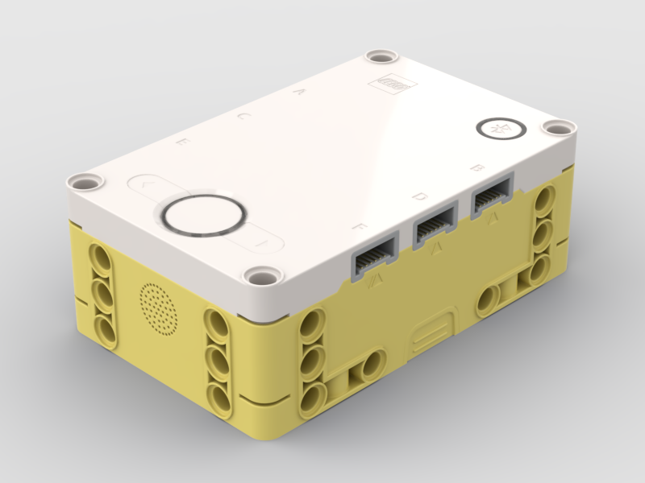

### Electromechanical wiring diagram

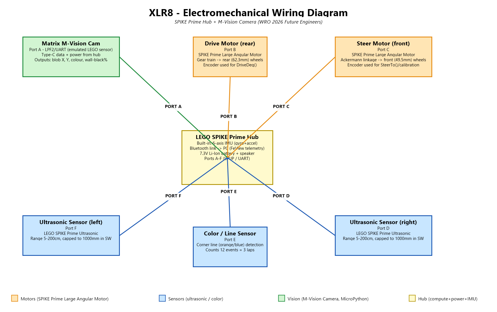

| Hub port | Device |
|---|---|
| **A** | M-Vision Camera (LPF2/UART, emulated LEGO sensor over Type-C) |
| **B** | Drive motor → rear wheels |
| **C** | Steer motor → front wheels (Ackermann linkage) |
| **D** | Ultrasonic sensor (right) |
| **E** | Color/line sensor |
| **F** | Ultrasonic sensor (left) |
| *(internal)* | 6-axis IMU, Bluetooth (telemetry to PC via `FeView.py`), 7.3 V Li-Ion battery, speaker |

Ports/pins are taken directly from [`src/hub/FeFunctions.py`](src/hub/FeFunctions.py) so this diagram always matches the code.

### Calibration

* **Camera** — auto-gain and auto-white-balance are **disabled** (mandatory, otherwise the camera re-derives its own color space every time lighting changes and every threshold breaks); color thresholds and LAB values are tuned for the competition mat.
* **Ultrasonic** — raw reads are never trusted directly: `-1` (no echo) and out-of-range values are capped before use, so a single bad read can't throw the controller into full-lock steering.
* **Steering** — `CalibrateSteer()` sweeps to both end-stops, measures the true range from the encoder, and resets zero to the exact middle, run before every start.
* **Gyro bias** — `ThetaCalibrate()` measures the gyro's standing bias for 0.8 s before the robot moves (a real gyro at rest does not read exactly zero), so bias can't masquerade as slow rotation for three minutes.

### Failure modes and mitigation

| Sensor | Failure mode | Mitigation |
|---|---|---|
| Camera | Glare/reflections cause false positives | Density + aspect-ratio blob filters |
| Camera | Type-C connection issue | Re-seat cable; LPF2 NACK-heartbeat watchdog auto-reconnects |
| Ultrasonic | `-1` reading (no echo) | Capped to a safe large value before use |
| Ultrasonic | Open-side reading (very large) | Capped in `SteerClear`/`SteerOpen` before use |
| Ultrasonic | Distance < 150–200 mm (emergency) | Error forced to a large ± value to peel away immediately |
| IMU | Heading drift over 3 laps | Lagrange integrator + bias calibration (§6) |
| IMU | Gyro hiss while stationary | 0.5 deg/s deadband |
| Encoders | Steering "zero" drifts | `CalibrateSteer()` runs before every start |
| Color sensor | Corner misdetection | Counts exactly 12 events (4 corners × 3 laps), ignores extras |

## 5. Software Architecture and Obstacle Strategy

### The task, in software terms

WRO's Future Engineers task is really three problems stacked: the **Open Challenge** (3 laps around a square island, driving direction and corridor widths randomised before the run), the **Obstacle Challenge** (same 3 laps, but red signs must be passed on their right and green signs on their left), and **parallel parking** into a bay barely longer than the car.

Two rules shape every line of code:

1. **Car steering** — driving and steering are separate actuators; the car can never pivot in place, so every correction is a curve that must start early (`Forward()`/`Drive` vs `SteerTo()`/`Steer`).
2. **The run is ~3 minutes and twelve 90° corners long**, so any error that accumulates with time is multiplied by three laps.

The software runs on two computers: the **hub** runs Pybricks — [`FeFunctions.py`](src/hub/FeFunctions.py) (shared functions), [`FeOpen.py`](src/hub/FeOpen.py) and [`FeObstacle.py`](src/hub/FeObstacle.py) (the two competition programs), [`FeView.py`](src/hub/FeView.py) (telemetry) — and the **camera** runs its own MicroPython program: [`main.py`](src/camera/main.py) (vision) and [`LPF2.py`](src/camera/LPF2.py) (transport, emulating a LEGO sensor over UART).

`FeOpen.py` is intentionally simpler than `FeObstacle.py`: the Open Challenge has no signs to dodge and no parking, so it only needs `SteerOpen()` for wall-centring plus the same 12-line-event lap counter.

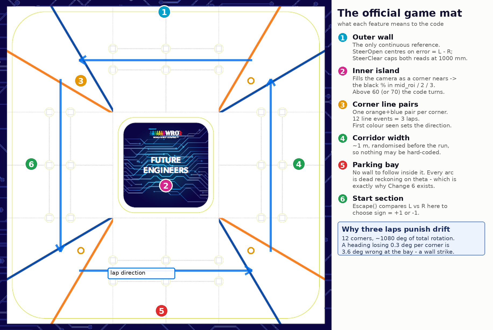

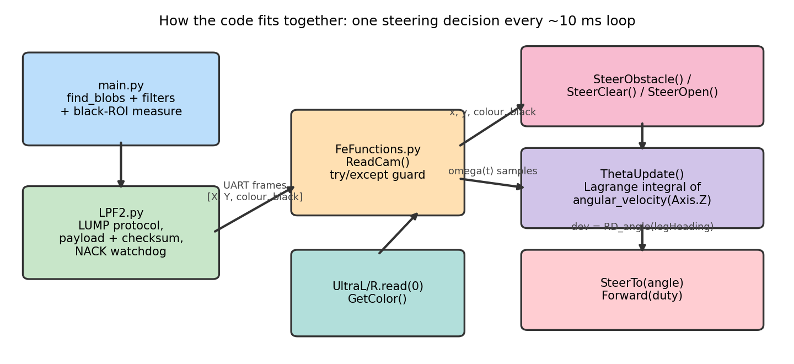

### Version 0 — the naive first version

One `find_blobs()` call with a single red/green threshold over the whole frame; the hub steered proportionally on `error = Left − Right` between the two ultrasonics, nudged toward a sign's fixed pixel x-target when one appeared, and counted corner lines with `GetColor()`. Heading came straight from `hub.imu.heading()`. It could finish an empty lap on a good day — then we added signs and changed the lighting.

### Problem → Change log

We didn't design the perfect program on paper — we wrote something that drives at all, then let the field tell us what was wrong. Every practice run produced a concrete failure; every failure became a numbered change.

**Problem 1 — The camera saw signs that weren't there.** A single red threshold over the full frame caught reflections, glare, and objects beyond the field; a sign's actual color also shifts with distance and lighting.

**Change 1 — Mask, multiply thresholds, filter blobs.** `main.py` blacks out the top strip and the vehicle's own footprint before `find_blobs()` runs; red is matched by three separate LAB thresholds (bright/darkened/heavily-darkened); surviving blobs must be dense (≥50–65% of their bounding box — solid signs vs. ragged reflections), have area > 200 px, and be taller than wide (aspect ratio < 0.9, since signs are standing pillars). Among survivors, the lowest one in frame (largest `cy`) is the closest, dodged first.

**Problem 2 — The dodge came too late and too hard.** A fixed pixel target ignores a far sign, then demands a violent full-lock swerve once it's close.

**Change 2 — Ramp the target with distance (`TargetX()`).** The steering target slides linearly from a mild "far" value to the full dodge value as the sign's y-coordinate (a distance proxy) grows, so the correction starts seconds early and ends as a smooth arc. The steering limit is staged too (20° far, 40° close).

**Problem 3 — Ultrasonic readings lie two different ways.** A missed echo returns `-1`; an open gap in the inner wall can read far past the corridor width — both send the centring controller into nonsense.

**Change 3 — Cap readings, split the controller.** Bad/`-1` reads are capped before use. `SteerOpen()` (open round, `Kp = 0.018`) and `SteerClear()` (obstacle round, larger `Kp`, forces the error to a hard ± value if either side drops below 150 mm) are separate functions. Corner initiation gets its own cue: `main.py` measures how much **black** (the wall) fills three horizontal ROIs; above a threshold, the code forces a hard turn — the wall itself is the corner detector.

**Problem 4 — Corner logic fired mid-corridor.** A hard sign-dodge can swing the body 40–50° off-axis; mid-swing the camera faces the outer wall and the black% spikes, triggering a false corner turn — and once rotated far enough, left/right readings effectively swap.

**Change 4 — The `legHeading` gyro filter.** `FeObstacle.py` tracks `legHeading = i × sign × 90`, the ideal corridor axis. Every loop computes `dev = RD_angle(legHeading)`. If `|dev| > 15°` (`GYRO_FLIP`) the car is judged rotated off-axis: the controller stops trusting L/R centring and instead flips/forces the error to bring `dev` back toward zero (whose sign also fixes the swapped-readings case).

**Problem 5 — The steering had no idea where "straight" was.** A motor encoder only knows relative angles, so "zero" at boot could mean anything, and a constant curve gets inherited by the whole run.

**Change 5 — End-stop calibration + a servo loop.** `CalibrateSteer()` sweeps to both stops, measures the range, and resets zero to the middle. `SteerTo(angle)` servos through a clamped output and a clamped target; `STEER_LOAD_CAP = 70` keeps the motor from stalling.

**Problem 6 — Three laps of noise poisoned the heading (the big one).** By this point `legHeading`, the escape turn, and the whole parking sequence all read `hub.imu.heading()`. That number is itself an internal integration of the gyro, and it accumulates vibration, small impacts and sensor-fusion micro-corrections — invisible on lap 1, several degrees wrong by lap 3.

**Change 6 — Lagrange-interpolated theta from angular velocity.** See [§6](#6-systems-thinking-and-engineering-decisions) for the full derivation.

**Problem 7 — Parking is dead reckoning, and dead reckoning needs a perfect angle.** The parking sequence is a fixed choreography of arcs with nothing inside the bay to correct against; a drifted heading turns a small entry-angle error into a collision with the bay limiter.

**Change 7 — Theta-driven escape and parking choreography.** `Escape()`, `GyroDeg`, `GyroColor`, `GyroAcc` and `GyroToWall` all read `Heading()` and call `ThetaUpdate()` every loop iteration (including inside blind manoeuvres), `ThetaReset()` replaces `hub.imu.reset_heading()`, and a 0.5 deg/s deadband stops the integrator creeping before the run starts.

### The camera side (`main.py` + `LPF2.py`)

`main.py` configures the sensor to QVGA RGB565 with auto-gain/auto-white-balance **off** (mandatory), applies the Change-1 masks and filters, runs `find_blobs`, measures the wall black-percentage in three ROIs, and packs `[X, Y, colour, black]` for the hub. `LPF2.py` implements LUMP (the LEGO UART Message Protocol) so the hub sees a genuine LEGO sensor: it handshakes at 2400 baud, then both sides jump to 115200 baud; a NACK-heartbeat watchdog declares the link dead (and re-initialises) if 8 expected heartbeats go missing, turning a brown-out into a ~2 s reconnect instead of a dead run. `FeFunctions.ReadCam()` wraps the read in try/except, degrading a glitch into one blind control cycle instead of a crash.

### End-to-end control loop

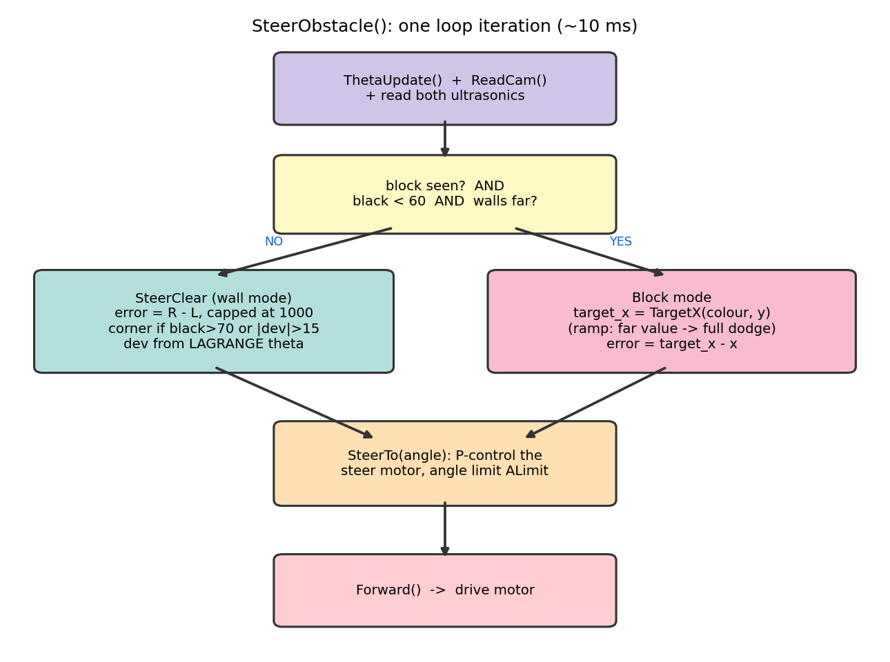

Each obstacle-round loop: `ThetaUpdate()` advances the heading integral → `ReadCam()` fetches `[X, Y, colour, black]` → ultrasonics are read and capped. If a sign is visible and no wall emergency is active, `TargetX` ramps the pixel target and `SteerTo` servos toward it under a staged angle limit; otherwise `SteerClear` centres between the capped wall distances, with `dev = RD_angle(legHeading)` (computed from the Lagrange theta) vetoing corners at the wrong time. `FeObstacle.py` counts twelve colour-line events to know when three laps are done, then hands off to parking.

## 6. Systems Thinking and Engineering Decisions

### Why interpolate at all?

We only know the angular velocity ω at discrete, unevenly-spaced instants $t_0 < t_1 < t_2 < t_3$ (loop jitter from the camera read, Bluetooth and garbage collection means the spacing is *not* a clean 10 ms), but we need the integral of the continuous signal between them. Every numerical integration method secretly assumes a model of what happens between samples — rectangle-sum assumes constant, trapezoid assumes a straight line. During a corner, yaw rate ramps from 0 to 100+ deg/s and back inside half a second, so that assumption matters a lot.

### Change 6 — Lagrange-interpolated theta from angular velocity

Instead of trusting the firmware's pre-integrated, pre-filtered `hub.imu.heading()`, we integrate the raw angular velocity ω(t) = `hub.imu.angular_velocity(Axis.Z)` ourselves, fitting the unique cubic **Lagrange interpolating polynomial** through the last 4 samples $(t_i, w_i)$:

$$L_i(t) = \prod_{j \ne i} \frac{t - t_j}{t_i - t_j} \qquad\qquad P(t) = \sum_{i=0}^{3} w_i\, L_i(t)$$

Each $L_i$ equals 1 at its own node and 0 at the other three, so $P(t)$ reproduces every sample exactly and is 4th-order accurate (the interpolation error scales with the 4th derivative of the true ω(t)). Node times appear explicitly in the formula, so **uneven spacing costs nothing** — exactly what a jittery loop needs.

Rather than evaluate $P(t)$ pointwise and approximate the integral with a quadrature rule, we build the same cubic in **Newton divided-difference form** and integrate it exactly. Divided differences $d_0..d_3$ give:

$$P(t) = d_0 + d_1(t-t_0) + d_2(t-t_0)(t-t_1) + d_3(t-t_0)(t-t_1)(t-t_2)$$

which we expand into ordinary coefficients $c_0..c_3$ and integrate with a plain antiderivative — the integral of a cubic is just another polynomial, so this is exact arithmetic, not an approximation:

$$\int_{t_2}^{t_3} P(t)\,dt \;=\; F(t_3) - F(t_2), \qquad F(x) = c_0 x + \tfrac{c_1}{2}x^2 + \tfrac{c_2}{3}x^3 + \tfrac{c_3}{4}x^4$$

Each loop advances theta by this exact integral over only the newest interval $[t_2, t_3]$ — no quadrature nodes, no magic constants.

Simulating a 3-lap run with realistic 2 deg/s gyro noise and jittery sampling:

| Integration method | Model between samples | Order | 3-lap error |
|---|---|---|---|
| Rectangle sum | constant | 1st | 0.21° |
| Trapezoid | straight line | 2nd | 0.13° |
| **Lagrange (N=4), exact cubic integral** *(ours)* | cubic | 4th | **0.02°** |

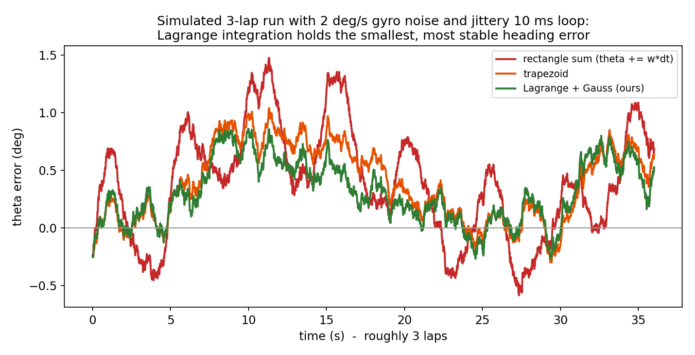

Three mechanisms explain the improvement:

1. **Noise averaging** — a corrupted sample doesn't enter the integral raw; the cubic through it and its 3 neighbours is only partly pulled toward the outlier.
2. **Bias removal** — `ThetaCalibrate()` measures our own gyro bias for 0.8 s under actual run conditions, instead of trusting factory calibration.
3. **No wrap, no fusion jumps** — theta is a plain unwrapped float (3 clockwise laps read ≈ −1080°), so angle arithmetic never sees a discontinuity, and no black-box sensor-fusion correction can step the value mid-corner.

The cost is honest: ~40 floating-point multiplications per loop (trivial at 100 Hz) and a 0.5 deg/s deadband that only ignores rotations slower than the vehicle can meaningfully make.

```python
# src/hub/FeFunctions.py (excerpt)
def _integrate_cubic(ts, ws):
    # exact integral of the cubic through 4 points, over [ts[2], ts[3]]
    t0, t1, t2, t3 = ts
    w0, w1, w2, w3 = ws

    d0 = w0
    d1 = (w1 - w0) / (t1 - t0)
    d12 = (w2 - w1) / (t2 - t1)
    d2 = (d12 - d1) / (t2 - t0)
    d23 = (w3 - w2) / (t3 - t2)
    d3 = ((d23 - d12) / (t3 - t1) - d2) / (t3 - t0)

    c3 = d3
    c2 = d2 - d3 * (t0 + t1 + t2)
    c1 = d1 - d2 * (t0 + t1) + d3 * (t0*t1 + t0*t2 + t1*t2)
    c0 = d0 - d1 * t0 + d2 * t0*t1 - d3 * t0*t1*t2

    def F(x):
        return ((((c3 * 0.25 * x + c2 / 3.0) * x + c1 * 0.5) * x) + c0) * x

    return F(t3) - F(t2)

def ThetaUpdate():
    global _theta
    t = theta_clock.time() / 1000.0
    w = hub.imu.angular_velocity(Axis.Z) - _omega_bias
    if -OMEGA_DEADBAND < w < OMEGA_DEADBAND:
        w = 0.0
    if _theta_ts and t <= _theta_ts[-1]:
        return _theta
    _theta_ts.append(t); _theta_ws.append(w)
    if len(_theta_ts) > THETA_N:
        _theta_ts.pop(0); _theta_ws.pop(0)
    n = len(_theta_ts)
    if n == 4:
        _theta += _integrate_cubic(_theta_ts, _theta_ws)
    elif n >= 2:
        _theta += 0.5 * (_theta_ws[-1] + _theta_ws[-2]) \
                      * (_theta_ts[-1] - _theta_ts[-2])
    return _theta
```

Full source: [`src/hub/FeFunctions.py`](src/hub/FeFunctions.py).

### Parking: the manoeuvre with no sensors

Everything up to this point has a reference to correct against — a wall, a line, an island. **Parking has none of them.** Once alongside the bay, the ultrasonics are too close/low to range usefully, the camera looks along the wall rather than at anything measurable, and the bay is entered backwards. The manoeuvre is therefore pure dead reckoning: fixed arcs, each driving a measured encoder distance while servoing the steering to hold a heading taken from `Heading()`.

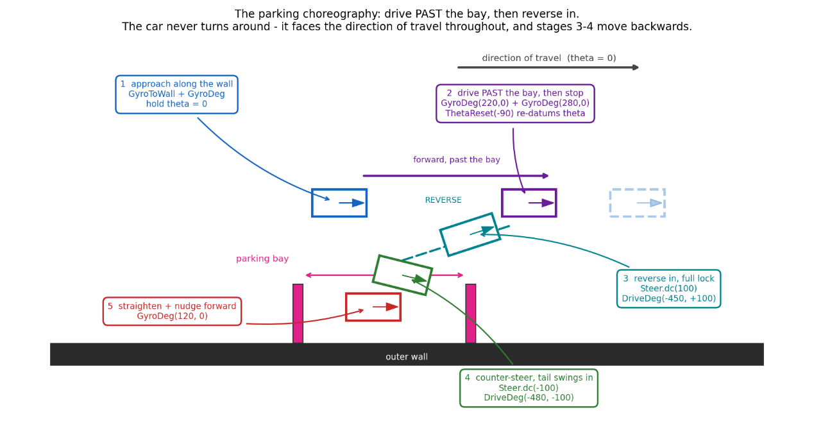

1. **Onto the bay straight** — after the 12th corner-line event, a staged `GyroAcc` + `GyroDeg` carry the car around the final corner holding a heading around `sign × 1168°` (3 laps of accumulated rotation + the approach angle), then a short manual steer-flick straightens the car against the wall.
2. **Find the bay by its two limiter walls** — `GyroToWall()` drives forward holding heading until the *side* ultrasonic drops below 120 mm (a limiter passing the sensor); two short `GyroDeg` legs then step between the limiters, so the gap (randomised each run) is *measured*, not assumed.
3. **Datum and reverse in** — `ThetaReset(±90)` re-datums the estimator to the bay axis; the car creeps forward until `Heading()` crosses ~7°, then full lock + `DriveDeg(-450, ±100)` reverses along the first arc, opposite lock + `DriveDeg(-480, ∓100)` swings the tail in, then a straightened `GyroDeg(120, 0)` nudges forward to centre.

The two branches (`sign == -1` / `sign == 1`) in [`FeObstacle.py`](src/hub/FeObstacle.py) are mirror images of each other for the two possible lap directions.

The car turns ~1080° over three laps and twelve corners before it ever sees the bay. A heading source losing just 0.3°/corner (invisible on lap 1) arrives 3.6° wrong — enough for a 450-encoder-degree reverse arc to walk the tail sideways into a limiter, in a gap only ~1.5 vehicle-lengths wide. With the Lagrange integrator (≈0.03°/corner) the same twelve corners contribute a few tenths of a degree total, so the hand-tuned arc distances stay valid run after run.

Full source: [`src/hub/FeObstacle.py`](src/hub/FeObstacle.py).

## 7. Repository / build instructions

* **Hub code** ([`src/hub/`](src/hub/)) is written for **Pybricks** running on the LEGO SPIKE Prime Hub.
  * Install the [Pybricks firmware](https://pybricks.com/install/) on the hub, open [Pybricks Code](https://code.pybricks.com/), and upload `FeFunctions.py` alongside whichever entry point you want to run: `FeOpen.py` (Open Challenge), `FeObstacle.py` (Obstacle Challenge), or `FeView.py` (live sensor telemetry over the hub's Bluetooth REPL — useful for debugging without re-flashing).
* **Camera code** ([`src/camera/`](src/camera/)) is written in **MicroPython** for the Matrix Robotics M-Vision Cam (OpenMV-based).
  * Flash with the [OpenMV IDE](https://openmv.io/pages/download), then upload `main.py` and `LPF2.py` to the camera's filesystem so it boots straight into vision mode and starts emulating a LEGO UART sensor for the hub.
* No external Python packages are required beyond what ships with Pybricks / OpenMV firmware.

## 8. Future Improvements

**Software & reliability**
- Dual-controller architecture (Raspberry Pi for vision + Arduino for real-time motor control) for parallel processing and deterministic timing.
- Lightweight neural-network vision to replace hand-tuned color thresholds.
- External 9-axis IMU for better drift correction.
- Robust UART communication: packet retransmission, timestamps, command validation.
- Expanded watchdogs (ultrasonic/IMU/encoder staleness + auto re-calibration) and crash detection/recovery via accelerometer spikes.
- Automatic retry logic for sensor failures/timeouts.
- Profiling and optimizing critical loops; centralized tunable-parameter config file.
- Structured, real-time logging; backup wall-following/waypoint navigation modes.

**Hardware**
- Rigid custom 3D-printed chassis to reduce flex and improve steering precision.
- Higher-torque motors for more consistent parking.

**Testing & debugging**
- Web-based telemetry dashboard (live video, sensor data, remote tuning).
- Unit tests for `ThetaUpdate()`, `SteerTo()`, `ReadCam()`.

## 9. Conclusion

This robot is the result of an iterative engineering process: build something that works, test on the real field, find a concrete failure, fix it, test again. Every design choice — from steering geometry and sensor placement to the chassis structure and the heading estimator — was driven by data from that loop rather than decided on paper in advance.

The robot can currently complete both the Open and Obstacle challenges reliably; future work will focus on reducing chassis weight, optimizing the drivetrain, improving the vision pipeline, and continuing to refine the control software for speed and accuracy. This documentation is meant to let anyone understand, reproduce and extend what we built.
