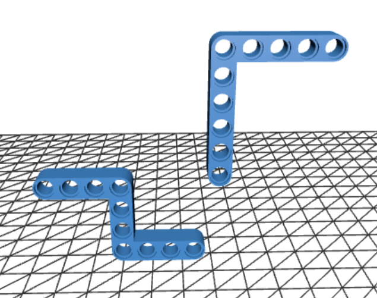
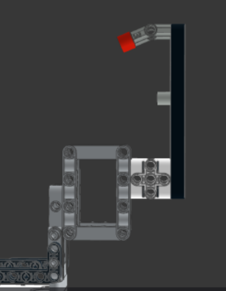
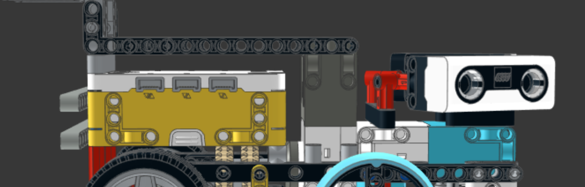
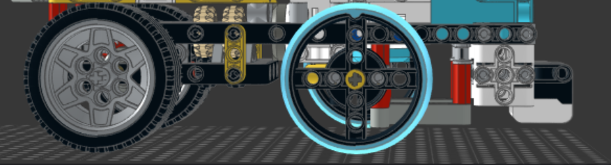
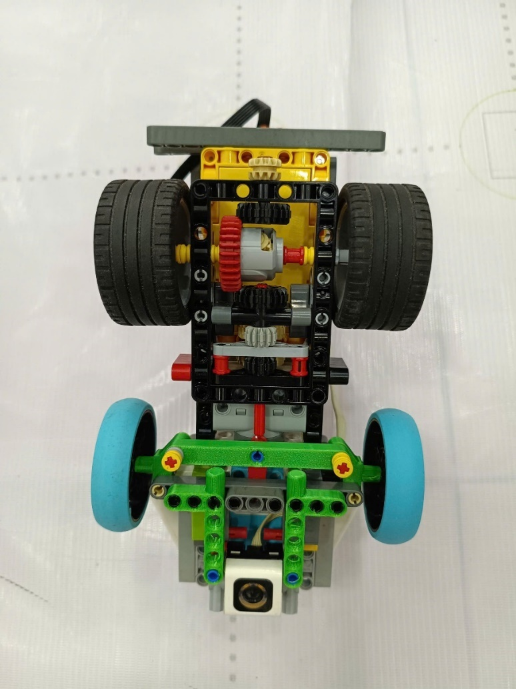

Robot's Detailed Construction Guide
====

This guide is a comprehensive, step-by-step walkthrough of the assembly of our autonomous robot for the **2026 WRO Future Engineers** competition. The assembly is organized into individual modules — the rear camera mount, the main chassis, and other key subsystems. Each section describes the assembly procedure and the connections between components, enabling readers to understand the robot's structure and accurately reproduce the complete model.

## Assembly overview

The robot consists of three main sections:

* **Rear Camera Assembly** — 1 Matrix M-Vision Camera mounted on a support structure constructed from LEGO Technic beams and connectors.
* **Upper Chassis** — 1 LEGO SPIKE Prime Hub with a rechargeable battery, 2 LEGO SPIKE Prime Large Angular Motors, and 2 ultrasonic sensors, all mounted using LEGO Technic connectors and structural reinforcement components.
* **Lower Chassis** — 4 LEGO Technic wheels (56 × 14 mm), 1 LEGO SPIKE Prime Color Sensor, and the drivetrain consisting of LEGO Technic gears, axles, and connector elements.

## Step 1: Preparing the 3D-printed parts

These two components are the only **custom 3D-printed parts** used in our robot and are essential to its overall mechanical design. They serve as key structural elements that integrate multiple assemblies into a single rigid framework while providing the precise geometry required for the robot's operation. No existing LEGO Technic components can adequately replace these parts without compromising the robot's structural integrity, stability, or functionality. Their use enables a more compact, robust, and reliable design while preserving seamless integration with the surrounding LEGO Technic system.

The CAD source files for these 3D-printed components are in [`../models/`](../models/).

**Material recommendations.** All custom parts for our robot are 3D-printed using PLA filament. PLA was chosen for its ease of printing, good dimensional accuracy, and sufficient strength for our application. The main chassis, motor mounts, sensor brackets, and camera support mast are all printed in PLA, as the material provides adequate rigidity and impact resistance for the robot's operational loads while remaining lightweight. PLA also allows for fast iteration during testing, enabling us to refine designs quickly between practice sessions.

## Step 2: Assembling the rear camera-mounted section

The rear camera assembly is the simplest subsystem to construct, as it is mechanically independent from the main chassis and consists of only a small number of components. Its modular design also simplifies both assembly and maintenance.

The assembly begins by connecting two LEGO Technic Liftarm Thick 1 × 13 beams using a LEGO Technic Liftarm Thick 1 × 5 beam, forming the primary support structure. At the lower end of this structure, the counterweight — constructed from a LEGO Technic Liftarm, Modified Frame Thick 5 × 7 Open Center — is secured using two LEGO Technic Pin Connector Blocks (1 × 3 × 3) to provide additional rigidity and improve the overall stability of the camera mount. Finally, the camera is installed at the top of the assembly using two LEGO Technic Axle and Pin Connectors (157.5°) together with a LEGO Technic Liftarm Thick 1 × 7, which forms a rigid and elevated camera mount. This configuration provides stable support for the camera while minimizing vibrations during robot operation.

## Step 3: Assembling the upper chassis section

The upper chassis assembly is the second most complex subsystem of the robot. Although it integrates several major electronic and structural components, its modular design allows it to be assembled efficiently by following the steps outlined below.

Assembly begins with the LEGO SPIKE Prime Hub, equipped with its rechargeable battery, which serves as the central structural and control unit of the robot. The previously assembled rear camera module is then attached to the rear of the hub using the two custom PLA 3D-printed L-shaped connectors described earlier. To further improve rigidity, two LEGO Technic Liftarm Thick 1 × 13 beams are installed on both sides of the connection, forming a robust interface between the main chassis and the elevated camera assembly.

An additional pair of LEGO Technic Liftarm Thick 1 × 13 beams is mounted behind the SPIKE Prime Hub to prevent unwanted movement of the hub during operation. These beams reinforce the rear section of the chassis, ensuring that the hub remains securely fixed despite vibrations and dynamic loads encountered while the robot is moving.

At the front of the hub, the primary LEGO SPIKE Prime Large Angular Motor is installed. This motor is connected to the hub using the previously mentioned 1 × 13 beams together with two LEGO Technic Liftarm Thick 1 × 15 beams positioned underneath. Besides securing the motor, these structural members act as the primary bridge between the front and rear sections of the robot, significantly increasing the rigidity of the chassis.

Finally, the second LEGO SPIKE Prime Large Angular Motor, together with the two ultrasonic sensors, is assembled at the front of the chassis. The ultrasonic sensors are mounted directly above the motor using a LEGO Technic Liftarm Thick 1 × 9, four angled pin connectors, and a LEGO Technic Bent Liftarm Thick L-shaped 2 × 4. This arrangement provides a stable mounting platform while maintaining accurate sensor alignment. The steering motor is further connected to the rest of the chassis by two additional 1 × 9 liftarms positioned on either side, creating a rigid structural bridge that integrates the front assembly with the remainder of the robot. This design ensures that both the steering mechanism and the sensors remain securely aligned, contributing to reliable navigation and consistent performance throughout operation.

## Step 4: Assembling the lower chassis section

The lower chassis assembly is the most intricate subsystem of the robot and requires the greatest level of precision during assembly. It incorporates the drivetrain, steering mechanism, and line-following sensor, all of which must be accurately aligned to ensure reliable operation. The primary structure is built around a LEGO Technic Open Frame 7 × 11, reinforced by two LEGO Technic Liftarm Thick 1 × 11 beams at the front to provide a rigid and stable foundation for the entire lower chassis.

Assembly begins with the rear-wheel drivetrain. The two 62.4 mm LEGO Technic tires are mounted on a shared axle approximately 10 cm in length. A series of three interconnected gears transfers rotational power efficiently from the drive motor to both rear wheels, ensuring synchronized rotation and smooth propulsion while maximizing the drivetrain's mechanical efficiency.

The rear drivetrain is then connected to the front steering assembly through a compact gear transmission consisting of four adjacent gears. Rather than transmitting propulsion, this gear train transfers the steering motion generated by the steering motor to the front axle, allowing both front wheels to rotate simultaneously while maintaining the Ackermann steering geometry (see [main README §3](../README.md#3-mobility-and-mechanical-design) for the full derivation).

The front wheel assembly consists of two 49.5 mm LEGO SPIKE Prime wheels connected by a common steering axle. This axle is directly linked to the steering motor mounted in the upper chassis, enabling precise and synchronized steering of both front wheels. The steering linkage is carefully configured to implement Ackermann steering geometry, improving cornering accuracy and reducing wheel slip during turns.

Finally, the LEGO SPIKE Prime Color Sensor is installed at the front of the lower chassis. In addition to providing reliable line detection, its mounting structure is integrated with the front steering assembly, increasing the rigidity of the front chassis and improving the overall structural integrity of the robot. Together, these components form a compact, robust, and mechanically stable lower chassis capable of delivering precise steering, efficient propulsion, and reliable sensor performance throughout the competition.

## Final step: software and wiring

Integrate the software, control algorithms, and wiring system described in [`../src/`](../src/) into the assembled robot. Once all electrical connections have been completed and verified, upload the program to the LEGO SPIKE Prime Hub and perform system checks to ensure that all sensors, motors, and electronic components communicate correctly and operate as intended.

Upon completing the four assembly stages, the robot is fully constructed and ready for electrical integration, software deployment, and performance testing. The modular design of each subsystem allows individual components to be assembled, inspected, and replaced independently, simplifying both maintenance and future design iterations.

Throughout the construction process, particular attention should be given to the alignment of the drivetrain, steering mechanism, and sensors, as even minor assembly inaccuracies can affect the robot's overall performance. By following the procedures described in this guide, readers should be able to accurately reproduce our robot and obtain a mechanically stable platform suitable for autonomous operation.

See the [main README](../README.md) for the robot's electrical architecture, wiring layout, and software implementation — how the assembled hardware is integrated into a fully functional autonomous system.
