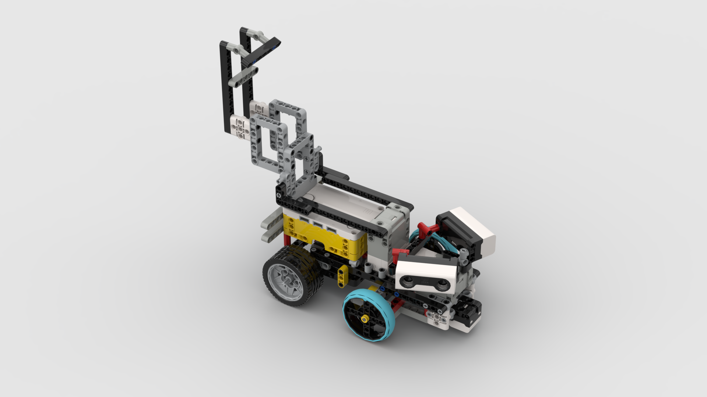

3D models
====

This directory contains the files used by 3D printers (and any laser-cutting/CNC files) to produce the vehicle's custom parts — the rear camera mast/mount, counterweight box, and other PLA-printed brackets described in the [main README](../README.md#3-mobility-and-mechanical-design).

| File | Purpose |
|---|---|
| `XLR8 - Future Engineers main design.io` | Full CAD assembly (source project) |
| `Ultra_adapter.STEP` | Ultrasonic sensor mount |
| `Camera adapter.stl` | Rear camera mast/mount, ready to print |
| `Multifunctional parts.stl` | Misc. PLA-printed brackets/connectors |
